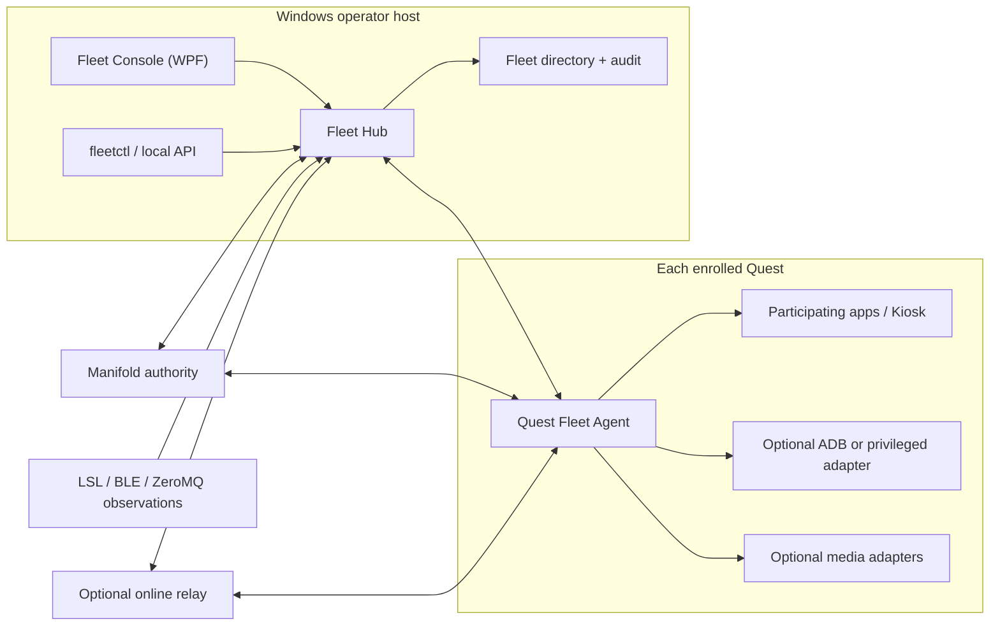
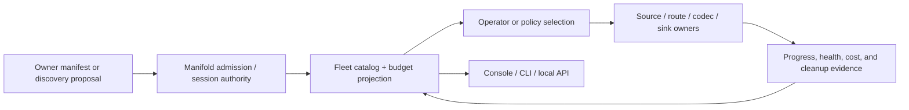
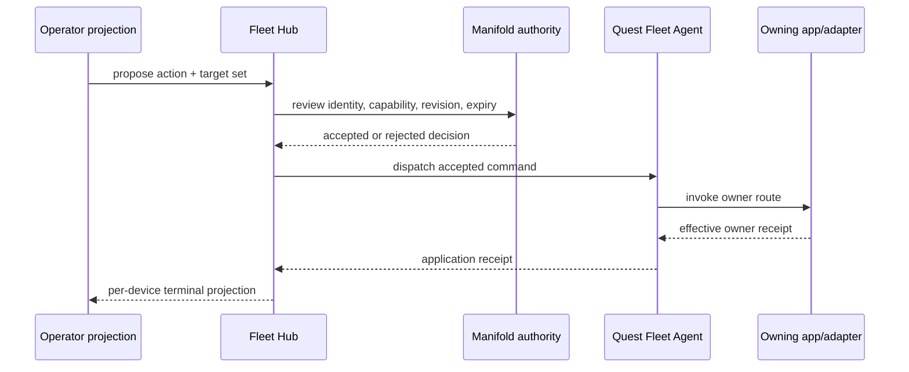

# Architecture

## Decision

Rusty Fleet is a dedicated Hostess/operator product. It is not a mode inside
QuestIonAble File Manager and it does not absorb Manifold, Quest, Kiosk, LSL, or
media authority.

The product uses one authority-aware Fleet Hub with two equivalent operator
projections: a WPF Fleet Console and `fleetctl`/local API. A Quest Fleet Agent
checks in over authenticated app-level networking. Optional adapters expose
stronger device capabilities without changing the base monitoring contract.

## Scope

Rusty Fleet owns:

- enrollment and operator-facing fleet composition;
- a durable device directory distinct from an active peer mesh;
- accepted device-status projections and truthful staleness;
- fleet-level selection, filtering, grouping, and action planning;
- canonical query, saved-view, navigation-restoration, and operator-projection
  contracts;
- command fan-out tracking, per-device result aggregation, and audit views;
- the Windows dashboard, CLI, and local API;
- product policy for when adapters are offered to an operator.

## Non-scope

Rusty Fleet does not own:

- Android permissions, foreground observation mechanisms, package lifecycle,
  or effective device state;
- generic command/session/peer/stream authority;
- app-local kiosk behavior;
- file-system or ADB command semantics;
- media codecs, capture, socket ownership, or rendering;
- LSL protocol compatibility;
- a universal transport, clock, queue, or recording policy that overrides the
  declaring owner;
- arbitrary control of nonparticipating foreground applications;
- hidden privilege escalation or automatic ADB enablement.

## System view



The arrows describe adapter flow, not transferred ownership. Manifold remains
the acceptance authority for commands, sessions, peer state, replay, expiry,
revocation, and stream references.

## Planes

### Control plane

Low-rate, authenticated, revisioned messages:

- enrollment and key rotation;
- device status and capability snapshots;
- command proposals, review decisions, dispatch, completion, and audit;
- stream/session references and route intent.

Control messages are bounded and idempotent. They never carry camera frames,
audio buffers, meshes, depth, or high-rate tracking payloads.

### Observation plane

Adapters may produce observations or discovery proposals through:

- the Quest Fleet Agent's authenticated status channel;
- LSL-compatible observations;
- BLE rendezvous;
- bounded ZeroMQ bridges;
- ADB readback when independently available.

Observations do not silently become accepted membership, command authority, or
media routes. The Hub displays source, age, confidence, and authority state.
Timestamped samples preserve their source domain and correlation evidence.
Recovery and producer restart remain distinguishable through separate route
and source epochs.

### Media plane

Media is selected, separately authorized, and independently observable:

```text
source/acquisition
  -> encoder or serializer
  -> framing/packetization
  -> route/socket provider
  -> depacketizer/demux
  -> decoder or schema validator
  -> sink
```

Manifold owns accepted session and stream references. Rusty Quest owns platform
capture/adoption. Every selected source and sink reports its own effective
receipt. The dashboard never assumes that a status connection can carry media.

The normative product contract for all planes is
[Datastream Management](DATASTREAMS.md). It defines the common and native
descriptors, auditable source selection, component epochs, time correlation,
cadence, lifecycle, profile-specific progress/health stages, per-edge bounded
queues, scientific recording/replay, admission budgets, observability,
privacy, and validation without defining a universal wire protocol.

## Datastream control loop



Fleet admission preserves protected control capacity and applies bounded
per-device, provider, route, host, relay, and global budgets. A stable stream
identity plus the relevant source, route, processing, and sink epochs and
accepted authority revision keys current evidence. A composite path generation
may summarize that lineage but cannot replace it. Transport/process activity,
bytes, sample/frame progress, decode/schema validity, sink progress, recording,
and cleanup remain independent facts.

## Device capability model

The UI presents capabilities rather than a single online/offline flag.

| Capability level | Example evidence | Permitted product behavior |
| --- | --- | --- |
| Seen | recent discovery proposal | show an untrusted candidate only |
| Enrolled | authenticated identity and current grant | accept status check-ins |
| Participating app | app-local capability receipt | invoke that app's approved actions |
| Platform-observable | Quest effective permission/profile receipt | show broader battery, lifecycle, or foreground facts |
| ADB-available | serial-scoped transport plus adapter capability | offer File Manager and administrative utilities |
| Media-ready | accepted stream/session plus provider receipts | offer selected preview/stream actions |
| Relay-reachable | current relay lease and end-to-end identity | monitor/control under relay policy |

Loss of evidence removes the capability or marks it stale. It does not preserve
optimistic UI controls.

## Status model

Each accepted device projection includes:

- stable enrolled device ID, display label, and hardware class;
- agent build, platform build, and capability revision;
- last check-in, source timestamp, receive timestamp, and staleness state;
- battery level, charging state, and thermal/power warnings when available;
- lifecycle and foreground facts with the reporting authority named;
- network route summaries without exposing private endpoint data by default;
- available and selected stream summaries with component epochs, timestamp
  domains, freshness, progress stage, queue pressure, and budget state;
- active participating app and kiosk state;
- ADB, file-management, media, and relay capability states;
- outstanding command count and last terminal command result.

The device directory can retain offline enrolled devices. Active peer-mesh
membership remains a separate, bounded Manifold concept.

## Operator projection model

The authoritative operator-information architecture is
[Operator UI Architecture](OPERATOR_UI.md). Fleet Hub emits versioned,
presentation-neutral projections for:

- summary counts and their query revision;
- fleet rows;
- the selected-device inspector;
- full device detail;
- alerts and grouped causes;
- operation summaries and per-target ledgers;
- selected media-session readiness;
- saved views and navigation restoration.

These are projections over accepted domain facts, not parallel domain models.
Every mutable condition carries its source and timing chain, accepting
authority and revision, freshness, reason, and sensitivity where applicable.
Independent condition families must not be collapsed into a health score.

Console, CLI, and local API use the same canonical query expression and result
revision. The Console may virtualize and window presentation, but it cannot
change result membership, target scope, action availability, or evidence
semantics.

Live cell values may update in place. Order- or group-affecting changes are
queued while an operator interacts and are applied explicitly. This protects
focus, selection, batch scope, and confirmation context without weakening
current-fact preflight.

## Command lifecycle



A dispatch acknowledgement is intermediate evidence. Completion requires the
current owner receipt and any selected cleanup receipt. Fleet fan-out never
collapses per-device failures into a false aggregate success.

A multi-device action uses an inspectable target snapshot plus per-target
preflight. Aggregate counts are navigation into the per-target ledger, never a
replacement for it. Retry and cancellation create explicit lineage, and
cleanup remains a separate terminal dimension.

## Kiosk and foreground control

No-ADB control is limited to participating applications and explicitly granted
platform routes. A Fleet Agent may ask Kiosk or another integrated app to
perform an app-owned action. It cannot claim universal input injection or
arbitrary control of whichever third-party app happens to be foreground.

Broader foreground observation or control requires a distinct Quest platform
capability, permission, or privileged adapter and must be shown separately in
the UI.

## File management boundary

QuestIonAble File Manager remains the owner of file and ADB utilities. The first
Fleet adapter should call its versioned JSON CLI/local API and project
structured progress into Fleet Hub. A future shared package is allowed only
after a neutral contract and second-consumer/conformance gate.

Fleet Hub owns selection, fan-out, scheduling, and aggregation. File Manager
owns individual file-operation semantics and device evidence.

## Identity and security

- Enrollment produces a stable device identity and revocable operator grant.
- Transport uses mutually authenticated sessions or an equivalent
  identity-bound channel.
- Commands bind target identity, capability, authority revision, request ID,
  expiry, and replay state.
- Destructive or high-impact actions require explicit operator confirmation
  and may require stronger roles.
- Tokens and requests are bounded, short-lived, and auditable.
- Relay operators cannot silently expand device capabilities.
- Secrets, real endpoints, device serials, raw logs, and captures stay outside
  the public repository.

## Deployment modes

1. **Local only:** Hub and devices share a reachable network; relay is absent.
2. **Hybrid:** local routes are preferred, with relay for monitoring and
   control fallback.
3. **Remote:** devices and operator connect through a relay; media may use a
   separate direct or relayed route.
4. **Privileged device:** an opt-in sidecar or on-device ADB loopback exposes a
   narrowly granted adapter. This is never part of the base profile.

All modes use the same authority engine and product contract. Placement is an
adapter choice, not a second definition of behavior.
