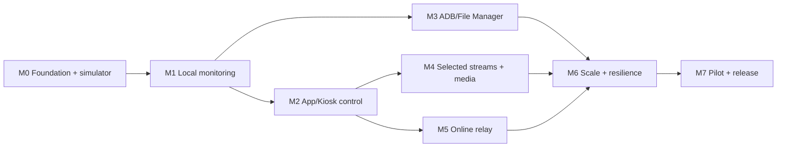

# Rusty Fleet Implementation Plan

## Purpose

This document is the step-by-step implementation guide for a dashboard that
manages multiple Meta Quest headsets in parallel. It deliberately uses a small
number of stacked milestones. Each milestone produces a usable vertical slice
and includes the contracts, engine behavior, adapters, operator projections,
negative paths, evidence, and rollback needed to accept that slice.

The roadmap must not be converted into a long sequence of one-file or
one-test lifecycle units.

## Product outcome

An operator can:

- see every enrolled headset currently checking in without requiring ADB;
- understand battery, charging, lifecycle, foreground, kiosk, connectivity,
  capability, and staleness state per headset;
- compare independent status families without losing the active fleet view;
- filter, group, select, and act on one or many devices;
- preview exact target membership, exclusions, risk, and changed facts before
  a fleet action;
- use participating-app controls when ADB is absent;
- open full file-management and administrative utilities when USB or Wi-Fi ADB
  is independently available and authorized;
- select media streams without putting high-rate data into the control plane;
- later use the same contracts through an online relay;
- understand what was proposed, accepted, dispatched, applied, rejected,
  expired, or cleaned up for every device.

## Architectural commitments

1. **Dedicated product:** Rusty Fleet is not embedded into File Manager.
2. **One authority engine:** Console and CLI/API are projections over Fleet Hub.
3. **No-ADB baseline:** authenticated app-level networking is the normal path.
4. **Truthful capabilities:** unavailable privilege produces a degraded state,
   not a hidden workaround.
5. **Manifold authority:** commands, sessions, peers, streams, replay, expiry,
   revocation, and audit remain Manifold-owned.
6. **Quest platform ownership:** Android permissions, lifecycle, foreground
   evidence, packaging, and effective device receipts remain Quest-owned.
7. **App ownership:** Kiosk and other participating apps own their actions.
8. **File ownership:** File Manager owns ADB-backed file operations.
9. **Separate media plane:** control messages reference media sessions; they do
   not carry media payloads.
10. **CLI/API parity:** every accepted dashboard action and report is
    automation-accessible.
11. **Closed-world activation:** every optional capability is inert until
    selected, approved, and effectively reported.
12. **Public-safe evidence:** this repo holds contracts and sanitized fixtures,
    never private device evidence.
13. **Condition vectors:** enrollment, freshness, power, app, route,
    authorization, privilege, media, work, and alerts are independent
    timestamped conditions, not one health score.
14. **Stable operator context:** live data does not silently discard filters,
    navigation, selection, focus, scroll, or confirmation scope.
15. **Inspectable batches:** target snapshots, per-target preflight, lifecycle,
    cleanup, retry, and cancellation are product contracts.
16. **Accessible scale:** keyboard, UI Automation, high contrast, scaling, and
    representative fleet sizes are milestone acceptance concerns.
17. **Stream identity:** a logical stream, source/route/processing/sink epochs,
    and accepted authority revision jointly identify current stream evidence;
    a composite path generation is presentation only.
18. **Explicit time:** source clocks, LSL correction, media PTS, receive time,
    wall time, uncertainty, reset events, transformations, and calibration
    lineage remain named and inspectable.
19. **Bounded flow:** every producer-consumer edge, retry, recovery, recording,
    and fan-out output has a declared bound and policy.
20. **Progress truth:** discovery, admission, transport/process, bytes,
    samples/frames, decode/schema, sink progress, and cleanup remain separate.
21. **Admission budgets:** protected control capacity and fair per-device,
    provider, route, host, relay, and global limits precede optional streams.
22. **Native scientific provenance:** normalized stream projections retain the
    native descriptor, selection evidence, timing lineage, and recording/replay
    provenance required by the selected scientific profile.

The normative UI behavior is in
[Operator UI Architecture](OPERATOR_UI.md); its external design pressure and
provenance are in
[the source ledger](research/FLEET_UI_SOURCE_LEDGER.md).
The normative cross-stream behavior is in
[Datastream Management](DATASTREAMS.md); current implementation maturity and
external design pressure are in the
[Morphospace stream matrix](research/MORPHOSPACE_DATASTREAM_MATRIX.md) and
[datastream source ledger](research/DATASTREAM_REFERENCE_LEDGER.md).

## Initial technical shape

The product repository will grow toward:

```text
apps/
  fleet-console-wpf/    native WPF operator projection
  fleetctl/             CLI projection
crates/
  fleet-contracts/      product-owned wire/data contracts
  fleet-hub/            state, command aggregation, policy integration
  fleet-simulator/      deterministic multi-device simulator
  fleet-adapters/       app/platform adapter boundaries
schemas/                public versioned JSON schemas
fixtures/               valid, boundary, damaged, and scenario fixtures
tools/                  validation and developer workflows
morphospace/            project composition and milestone state
```

Directory creation follows implementation need; empty architecture folders are
not evidence of progress.

## Milestone stack template

Every implementation milestone uses this internal order:

1. **Contract:** versioned types/schemas, invariants, valid/boundary/damaged
   fixtures, and authority owner.
2. **Engine:** deterministic state transitions, replay/staleness rules,
   persistence boundary, and unit/property tests.
3. **Adapter:** one real or simulated owner route with capability negotiation
   and effective receipts.
4. **Projection:** CLI/local API first or alongside WPF; identical inputs,
   decisions, and terminal evidence.
5. **Integration:** multi-device scenarios, concurrency/failure behavior, and
   cross-owner negative paths.
6. **Operations:** diagnostics, audit, cleanup, rollback, and migration.
7. **Acceptance:** Standard gate, plus device or Deep gates only when declared.

These are checklist layers inside one milestone unit. They are not automatic
sub-units.

## Milestone 0 — Foundation and multi-device simulator

### Outcome

A source-only Fleet Hub skeleton accepts deterministic simulated check-ins from
many devices, exposes the directory through CLI/local API, and demonstrates
truthful fresh/stale/offline and capability projections. No sockets, device
permissions, ADB, media, or relay are active.

### Stack

- Record product-boundary, threat-model, persistence, identity, and protocol
  ADRs. The M0 source boundary and threat model are accepted in
  [ADR 0004](decisions/0004-m0-source-boundary-and-threat-model.md); real
  ingress authentication and persistence selection remain closed later
  decisions.
- Define versioned device identity, status snapshot, capability snapshot,
  canonical status-condition, status-source, staleness, command-lifecycle, and
  audit contracts.
- Define source-only generic/native stream descriptors, source-selection,
  component-epoch, timestamp-correlation, cadence/absence, profile-specific
  progress/health, per-edge queue-policy, scientific-run/recording,
  admission-budget, and cleanup projections.
- Define separate versioned fleet-row, inspector, full-detail, summary-count,
  operation-ledger, canonical-query, saved-view, and navigation-restoration
  projections.
- Add valid, damaged, replayed, stale, reordered, and partial-capability
  fixtures.
- Add stream fixtures for native round trip, ambiguous cardinality, component
  epoch continuity, missing/degraded clock correlation, cadence and valid
  silence, no data, stall, byte-only activity, changing/static content,
  decode/sink failure, per-edge queue saturation, recording/replay, budget
  rejection, recovery, and cleanup failure.
- Implement an in-memory Hub state engine and deterministic clock.
- Implement a simulator that can create, update, disconnect, reorder, and
  damage at least a representative fleet, not just one happy-path device.
- Include deterministic 4, 50, 250, 1,000, and 5,000-device datasets without
  claiming that every size is supported.
- Expose list, inspect, filter, and watch through `fleetctl` and a local API.
- Add scenario tests for concurrent check-in, expiry, duplicate identity,
  capability downgrade, and restart projection.
- Document persistence and network adapters as closed interfaces; do not add
  them yet.

### Acceptance

- One command runs the deterministic scenario suite.
- CLI and local API return the same canonical device projections.
- Canonical queries return result revision, `as_of`, count, and window
  information, and saved views preserve their actual scope.
- Stale, offline, rejected, and downgraded devices are distinguishable.
- Independent condition families retain source, age, reason, authority, and
  freshness; no aggregate health score becomes authority.
- Simulated stream projections distinguish availability, admission, transport,
  payload progress, decode/schema, sink, recording, and cleanup, and reject
  stale component-epoch or authority evidence.
- Every simulated queue and budget is finite; status/control reserve remains
  available during simulated high-rate pressure.
- Invalid or replayed status cannot advance accepted state.
- Scale fixtures remain deterministic and bounded, and their use does not
  introduce UI or runtime effects.
- The feature lock remains empty and effect-free.
- Quick and Standard repository gates pass.

### Deferred

Real networking, Quest builds, WPF visuals, ADB, File Manager, Kiosk mutation,
media, relay, and live-device evidence.

## Milestone 1 — Local no-ADB fleet monitoring

### Outcome

Enrolled Quest devices check in over authenticated Wi-Fi without ADB. Fleet
Console, CLI, and local API show current status and staleness for multiple
headsets.

### Stack

- Define enrollment, key rotation, status transport, reconnect, and
  backpressure contracts.
- Add a Manifold-aligned local control/session adapter in Fleet Hub.
- Add an opt-in Quest Fleet Agent profile that reports only approved status
  fields and effective capability evidence.
- Define truthful sources for battery, charging, lifecycle, self/participating
  foreground state, and platform-limited foreground state.
- Admit one bounded timestamped-observation path against an exact promoted
  owner contract. Rusty LSL is the preferred compatibility adapter when its
  declared format, shape, discovery, recovery, clock, and queue surface fits;
  unsupported cases remain explicit.
- Preserve the complete native `StreamInfo`, deterministic candidate selection,
  raw source time, offset/uncertainty history, time-processing flags,
  source-versus-route epochs, nominal/measured cadence, sample progress, loss,
  backlog, recovery, and cleanup without making LSL discovery or `source_id` a
  device-enrollment or command-authority route.
- Add an XDF record/replay compatibility test before claiming scientific
  interoperability, without activating Fleet-controlled recording in M1.
- Add the first WPF fleet table with filtering, grouping, detail inspection,
  a persistent selected-device inspector, independent status grammar, visible
  active scope, stable live ordering, staleness, and capability projections.
- Establish Hub-owned saved-view persistence with an optimistic collection
  revision and exact query/navigation restoration before adding full-detail
  routes or richer view sharing; no saved scope may exist only in WPF state.
- Run the native WPF `DataGrid` and shell/theme dependency spike with at least
  1,000 simulated devices. Test virtualization, UI Automation, keyboard,
  Narrator, high contrast, scaling, focus, selection, license, and removal
  cost before adopting a theme library.
- Preserve complete CLI/local API parity.
- Add reconnect, sleep/wake, route loss, duplicate check-in, stale revision,
  key rotation, and agent-upgrade scenarios.
- Run one bounded real-device checkpoint only after source, build, and
  simulator checks pass.

### Acceptance

- Multiple devices can appear, disappear, reconnect, and age independently.
- The UI never presents a platform-limited fact as authoritative foreground
  state.
- Loss of transport or capability produces a visible degraded state.
- An ambiguous discovery result, missing recovery identity, stale component
  epoch, changed native descriptor, or unsupported stream shape fails closed
  with an inspectable reason.
- Detail navigation and refresh preserve query, filters, grouping, sort,
  selection, scroll anchor, focus, and inspector context.
- WPF watch consumption is cursor-bound and bounded; accepted events trigger a
  canonical query reread, rejected events remain distinct evidence, sequence
  reset rebases visibly, and malformed ordering retains cached rows.
- Keyboard, UI Automation, Narrator, high-contrast, large-text, and scaling
  gates pass for the fleet table and inspector.
- Order-affecting live changes do not move interaction-bound rows without
  explicit operator application.
- No ADB permission or File Manager dependency enters the base profile.
- Device cleanup and zero bounded fatal evidence accompany the live checkpoint.

### Deferred

App mutation, ADB/file utilities, media payloads, and online relay.

## Milestone 2 — Participating-app and Kiosk control

### Outcome

An operator can invoke approved Kiosk or participating-app actions on selected
devices without ADB, with per-device acceptance and application receipts.

### Stack

- Define command proposal, target set, review, dispatch, owner completion,
  rejection, expiry, cancellation, and aggregate projection contracts.
- Make the target set an inspectable, expiring snapshot keyed by device and
  identity revision; scheduled dynamic selectors remain explicit and preserve
  both planned and actual membership.
- Bind commands to device identity, app identity, capability, authority
  revision, request ID, expiry, and replay protection.
- Add a Kiosk client adapter without moving Kiosk action semantics into Fleet.
- Add fleet selection, dry-run/preview, confirmation, progress, retry-policy,
  cancellation, cleanup, and per-device result views.
- Preflight every target for identity, support, enablement, authorization,
  reachability, freshness, owner readiness, conflict, policy, resources,
  idempotency, and unresolved cleanup.
- Add identical `fleetctl` commands and structured reports.
- Test mixed-capability selection, partial failure, client restart, duplicate
  dispatch, stale grant, owner rejection, timeout, cancellation, and cleanup.
- Validate one real participating-app action end to end before broadening the
  action catalog.

### Acceptance

- Transport acknowledgement never appears as applied completion.
- Every target retains its own decision and terminal result.
- Confirmation shows exact target scope, exclusions, warnings, changed facts,
  concurrency, expiry, and risk.
- Nonparticipating or stale-capability apps fail closed.
- A batch can be retried without replaying already terminal non-idempotent work.
- Kiosk remains independently usable and releasable.

### Deferred

Universal OS input injection, arbitrary third-party app control, file
operations, media, and relay.

## Milestone 3 — Privileged ADB and File Manager utilities

### Outcome

When USB or Wi-Fi ADB is already enabled and authorized, an operator can open
the full per-device File Manager surface and run selected fleet-safe
administrative operations. Devices without ADB remain fully visible through the
base agent.

### Stack

- Define ADB availability, transport identity, device binding, privilege age,
  operation capability, and disconnect contracts.
- Integrate the File Manager JSON CLI/local API as the first adapter.
- Keep file-operation semantics, paths, transfer progress, cancellation, and
  device evidence in File Manager.
- Add Fleet scheduling, concurrency limits, selection, fan-out planning,
  aggregation, and safeguards for destructive actions.
- Expose a single-device deep-link/detail surface and bounded multi-device
  operations only where semantics are safe.
- Add USB loss, Wi-Fi ADB expiry, serial substitution, wrong-device binding,
  partial transfer, cancellation, insufficient space, and cleanup scenarios.
- Evaluate on-device ADB loopback only as a separate opt-in privileged adapter
  with explicit threat model and grant.

### Acceptance

- ADB loss removes only privileged controls; base monitoring continues.
- Every ADB command is serial/device scoped and rejects identity substitution.
- Destructive actions require explicit review and never inherit an ambient
  broad target set.
- File Manager remains the single owner of file-operation behavior.
- Cross-repository Standard checks pass before the bounded device suite.

### Deferred

Automatic ADB enablement, hidden developer-mode changes, broad shell authority,
and relay-to-ADB tunneling.

## Milestone 4 — Selected datastream and media operations

### Outcome

The dashboard composes available stream manifests, admits bounded
subscriptions or media sessions, and renders, hands off, records, or inspects
an explicitly chosen stream without coupling high-rate payloads to the fleet
control channel.

### Stack

- Implement the product-level stream catalog, lifecycle, component-epoch,
  time-correlation, health, sensitivity, cost, and layout projections over
  accepted Manifold manifests, subscriptions, and session references.
- Refine provider generation into source, route, processing, and sink epochs;
  keep source/acquisition, encoder/serializer, framing/packetization,
  route/socket, depacketizer/demux, decoder/validator, sink, and cleanup
  receipts distinct.
- Add per-device/provider/route/host and global admission budgets, protected
  control capacity, fair scheduling, deterministic rejection reasons, and
  bounded preemption.
- Adopt exact promoted Rusty Morphospace sample and media sources through
  adapters, beginning receiver-first for media.
- Add one selected sample/detail surface and one selected media preview, with
  equivalent CLI/API catalog, subscription, session, health, cost, and
  terminal reports.
- Keep previews explicitly selected and bounded; never decode media in fleet
  rows or create an automatic all-device wall.
- Define the Hostess FFmpeg process-adapter boundary: allowlisted argument
  templates, `ffprobe` machine-readable probing, `-progress` ingestion,
  protocol/demuxer/codec/resource limits, stage-specific watchdogs,
  protocol-specific timeouts, exact binary/pipeline identity, bounded output,
  complete process-tree ownership, graceful/forced termination, redaction,
  and cleanup. Direct `libav*` remains deferred until a measured process-boundary
  limitation and its ABI/security ownership gate are accepted.
- Keep consent-based display capture, privileged direct capture, ADB
  diagnostics, and compatibility tools as separate source classes. Select the
  effective display/source explicitly.
- Add bandwidth/decode/memory/disk limits, queue and drop policy, loss,
  reconfigure, reconnect, route fallback, per-edge/fan-out isolation,
  scientific-run/recording artifact and replay receipts, retention policy, and
  terminal cleanup behavior.
- Test wrong/ambiguous source, stale session or generation, unauthorized route,
  native-descriptor drift, channel/format/codec/framing mismatch, missing clock
  correlation, no data, byte-only activity, missing configuration/keyframe,
  decode failure, sink-without-frame, changing/static content, slow consumer,
  recorder/preview independence, budget rejection, unfair admission, partial
  fan-out, revoked consent, process-tree residue, and cleanup failure.
- Run device/performance validation only for the selected source/route/sink
  combinations being promoted, after their owning repositories have accepted
  the exact contracts.

### Acceptance

- Control-plane status remains responsive under media load.
- A stream is reported only at its strongest profile-required evidenced stage;
  active sink health requires advancing samples/frames under the current
  component epochs and accepted subscription/session, except where the profile
  explicitly declares content change or silence not applicable.
- Source timestamps and clock correlation remain inspectable; derived display
  time never destroys raw evidence.
- Queue, recovery, preview, recording, fan-out, and process lifetime remain
  bounded, and slow consumers cannot create unbounded memory or hidden latency.
- Admission is fair, auditable, respects protected control capacity, and
  reports resource exhaustion without optimistic fallback.
- Media permission or transport does not leak into the base monitoring profile.
- Terminal cleanup is independently observed.

### Deferred

An ambient all-device video wall, automatic high-bandwidth streaming,
unbounded recording, and a universal stream transport.

## Milestone 5 — Online relay and remote operations

### Outcome

The same device, command, and stream-reference contracts work across an online
relay with end-to-end device/operator identity, explicit tenancy, and
revocation.

### Stack

- Complete a relay threat model, tenancy model, data-retention policy, and
  incident/rotation plan before implementation.
- Separate relay placement and routing from Manifold/Fleet authority.
- Add mutually authenticated device and operator sessions, scoped grants,
  short-lived leases, replay protection, expiry, and audit.
- Define local-preferred, hybrid, and remote route selection with truthful
  failover.
- Evaluate remote data and media routes by payload class, congestion behavior,
  latency, reliability, encryption, fan-out, observability, recording/
  retention, and cost. SRT, RIST, WebRTC, and QUIC-based routes remain
  candidates until measured and explicitly selected.
- Treat failover as a new accepted route-epoch decision while independently
  evaluating source continuity; do not silently continue sequence, timestamp,
  or cleanup evidence across incompatible epochs.
- Add remote Console and CLI/API behavior without creating a second authority
  engine.
- Simulate partitions, duplicated delivery, delayed delivery, clock skew,
  tenant substitution, revoked devices, operator-role downgrade, and relay
  restart.
- Perform external security review before production exposure.

### Acceptance

- Relay compromise or misconfiguration cannot silently expand a device grant.
- Tenant, device, and operator substitution fail closed.
- Offline and partitioned states are explicit; queued commands have bounded
  expiry and visible policy.
- Audit can reconstruct decision and application lineage without raw private
  device payloads.
- Deep security and recovery gates pass.

### Deferred

Indefinite offline command queues, relay-owned device authority, and default
media relay.

## Milestone 6 — Scale, resilience, and fleet operations

### Outcome

The product operates predictably at the agreed local and remote fleet sizes,
survives restarts and partial outages, and exposes actionable health without
operator overload.

### Stack

- Fix load profiles and service-level budgets from measured Milestones 1–5.
- Keep the durable fleet directory separate from bounded active mesh/session
  membership.
- Add persistence, migration, backup/restore, compaction, and audit-retention
  policy.
- Add bounded concurrency, fair scheduling, grouping, saved views, alert
  suppression, maintenance windows, and rollout rings.
- Ratify stream admission, control reserve, queue, decode, fan-out, and
  recording budgets from measured profiles. Add overload, slow-consumer, and
  priority-inversion scenarios.
- Group alerts by actionable root cause and affected-device count so one
  adapter failure does not fan out into a fleet of duplicate incidents.
- Ratify or replace measured UI/query/preview budgets using 50, 250, 1,000,
  and 5,000-device datasets, windowed Hub queries, and stable-order churn.
- Add Hub restart, database damage, adapter crash, provider fresh-epoch,
  device churn, relay partition, and operator reconnect scenarios.
- Add performance, soak, memory, recovery-time, and observability gates.
- Add long scientific recording/replay, clock-history compaction,
  high-churn component-epoch, per-output slow-consumer, and simultaneous
  preview/record/relay soak gates.
- Enforce low-cardinality metrics, event timestamps instead of changing-age
  labels, seconds for durations, bytes for byte measures, and drill-down
  evidence outside metric labels.
- Refresh the tracked source/dependency/instruction graph.

### Acceptance

- Measured fleet-size and latency budgets pass with defined headroom.
- Backpressure cannot turn status or commands into unbounded memory growth.
- Restart preserves accepted identity/revision/audit state and rejects replay.
- Operators can distinguish a device fault, adapter fault, authority rejection,
  route failure, and presentation failure.
- Deep resilience and graph gates pass.

## Milestone 7 — Pilot and first supported release

### Outcome

A documented, supportable release is piloted with a bounded device cohort and
can be installed, upgraded, rolled back, audited, and operated by someone who
did not build it.

### Stack

- Freeze the exact product spec, feature descriptors, source composition, and
  release candidate.
- Run full owner-repo checks before device suites.
- Validate install, enrollment, upgrade, key rotation, normal operations,
  rollback, cleanup, and decommissioning.
- Complete operator, security, privacy, troubleshooting, and incident runbooks.
- Complete the release accessibility gate with keyboard-only, Narrator,
  Accessibility Insights, high contrast, large text, scaling, and
  multi-monitor evidence for primary workflows.
- Preserve failed attempts and rerun any touched owner after reliability fixes.
- Seal exact commits and trees in a release capsule.
- Publish source first and the planning/accounting state last when multiple
  repositories are involved.

### Acceptance

- All selected features are explicit and all unselected nearby features remain
  inert.
- Pilot devices return to the documented safe state after validation.
- Zero bounded package/system fatals and complete cleanup evidence are present.
- Rollback is rehearsed, not merely described.
- Release artifacts, documentation, and GitHub state agree at exact revisions.

## Dependency order



Milestones may overlap in research, but implementation authority remains with
one active stack. M3 and M4 can be reordered after M2 if product priorities
change; M5 should not begin until local identity, command, replay, expiry, and
audit behavior are accepted.

## Cross-cutting acceptance scorecard

Every milestone answers:

- **Authority:** who accepts the state or action?
- **Identity:** which device, app, operator, adapter, and authority revision?
- **Capability:** what exact current grant makes the action available?
- **Freshness:** how are age, replay, expiry, and restart handled?
- **Lineage:** which source, route, processing, and sink epochs produced the
  evidence, and what continuity was accepted?
- **Time:** which raw clock domains and correlation/uncertainty are preserved?
- **Progress:** what separately proves transport, bytes, payload advancement,
  decode/schema, sink, and cleanup?
- **Flow:** what bounds each graph edge, recovery, fan-out output, recording,
  and slow consumer?
- **Admission:** what protects control capacity and enforces fair
  per-device/provider/route/host/relay/global budgets?
- **Parity:** do Console, CLI, and local API invoke the same route?
- **Evidence:** what proves transport, acceptance, application, and cleanup?
- **Degradation:** what remains useful when ADB, media, relay, or privilege is
  missing?
- **Privacy:** what is retained, exported, or deliberately absent?
- **Rollback:** how is the feature disabled and state safely restored?
- **Cost:** which validation tier is justified by the change?
- **Projection:** do row, inspector, detail, alert, operation, and media views
  remain projections over accepted facts?
- **Scope:** can the operator and automation inspect the canonical query,
  result revision, selection, target snapshot, and exclusions?
- **Stability:** do refresh and navigation preserve operator context without
  weakening current-fact preflight?
- **Accessibility:** can keyboard, UI Automation, Narrator, high contrast, and
  supported scaling complete the same workflow?
- **Scale:** which deterministic fleet profile and measured budget support the
  claim?

## Next implementation action

Complete the active
`morphospace/iteration-units/fleet-m1-local-no-adb-monitoring.json` as one
stack. The accepted source foundation remains documented in
[Milestone 0 Source Foundation](M0_SOURCE_FOUNDATION.md); the active bounded
ingress and authority behavior are documented in
[Milestone 1 Local Monitoring Runtime](M1_LOCAL_MONITORING.md). Durable restart
recovery and the first bounded Quest checkpoint are now present. Finish the
remaining WPF/CLI/API scope parity and manual accessibility gates, remaining
negative-path integration, Standard and Deep gates, instruction-impact review,
and publication. The native 1,000-device table/inspector, canonical
search/freshness scope, grouping, stable hidden selection, out-of-scope
inspector context, mixed fresh/stale/offline and empty-scope fixture, and
presented keyboard/UI Automation path are now present. Do not create
transport-, screen-, or test-sized M1 sub-units. Corrections remain inside
this active stack.
