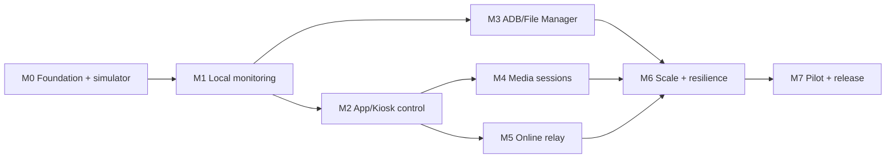

# Rusty Fleet Implementation Plan

## Purpose

This document is the step-by-step implementation guide for a dashboard that
manages multiple Meta Quest headsets in parallel. It deliberately uses a small
number of stacked milestones. Each milestone produces a usable vertical slice
and includes the contracts, engine behavior, adapters, operator projections,
negative paths, evidence, and rollback needed to accept that slice.

The roadmap must not be converted into a long sequence of one-file or
one-test lifecycle units.

## Product outcome

An operator can:

- see every enrolled headset currently checking in without requiring ADB;
- understand battery, charging, lifecycle, foreground, kiosk, connectivity,
  capability, and staleness state per headset;
- filter, group, select, and act on one or many devices;
- use participating-app controls when ADB is absent;
- open full file-management and administrative utilities when USB or Wi-Fi ADB
  is independently available and authorized;
- select media streams without putting high-rate data into the control plane;
- later use the same contracts through an online relay;
- understand what was proposed, accepted, dispatched, applied, rejected,
  expired, or cleaned up for every device.

## Architectural commitments

1. **Dedicated product:** Rusty Fleet is not embedded into File Manager.
2. **One authority engine:** Console and CLI/API are projections over Fleet Hub.
3. **No-ADB baseline:** authenticated app-level networking is the normal path.
4. **Truthful capabilities:** unavailable privilege produces a degraded state,
   not a hidden workaround.
5. **Manifold authority:** commands, sessions, peers, streams, replay, expiry,
   revocation, and audit remain Manifold-owned.
6. **Quest platform ownership:** Android permissions, lifecycle, foreground
   evidence, packaging, and effective device receipts remain Quest-owned.
7. **App ownership:** Kiosk and other participating apps own their actions.
8. **File ownership:** File Manager owns ADB-backed file operations.
9. **Separate media plane:** control messages reference media sessions; they do
   not carry media payloads.
10. **CLI/API parity:** every accepted dashboard action and report is
    automation-accessible.
11. **Closed-world activation:** every optional capability is inert until
    selected, approved, and effectively reported.
12. **Public-safe evidence:** this repo holds contracts and sanitized fixtures,
    never private device evidence.

## Initial technical shape

The product repository will grow toward:

```text
apps/
  fleet-console/        WPF operator projection
  fleetctl/             CLI projection
crates/
  fleet-contracts/      product-owned wire/data contracts
  fleet-hub/            state, command aggregation, policy integration
  fleet-simulator/      deterministic multi-device simulator
  fleet-adapters/       app/platform adapter boundaries
schemas/                public versioned JSON schemas
fixtures/               valid, boundary, damaged, and scenario fixtures
tools/                  validation and developer workflows
morphospace/            project composition and milestone state
```

Directory creation follows implementation need; empty architecture folders are
not evidence of progress.

## Milestone stack template

Every implementation milestone uses this internal order:

1. **Contract:** versioned types/schemas, invariants, valid/boundary/damaged
   fixtures, and authority owner.
2. **Engine:** deterministic state transitions, replay/staleness rules,
   persistence boundary, and unit/property tests.
3. **Adapter:** one real or simulated owner route with capability negotiation
   and effective receipts.
4. **Projection:** CLI/local API first or alongside WPF; identical inputs,
   decisions, and terminal evidence.
5. **Integration:** multi-device scenarios, concurrency/failure behavior, and
   cross-owner negative paths.
6. **Operations:** diagnostics, audit, cleanup, rollback, and migration.
7. **Acceptance:** Standard gate, plus device or Deep gates only when declared.

These are checklist layers inside one milestone unit. They are not automatic
sub-units.

## Milestone 0 — Foundation and multi-device simulator

### Outcome

A source-only Fleet Hub skeleton accepts deterministic simulated check-ins from
many devices, exposes the directory through CLI/local API, and demonstrates
truthful fresh/stale/offline and capability projections. No sockets, device
permissions, ADB, media, or relay are active.

### Stack

- Record product-boundary, threat-model, persistence, identity, and protocol
  ADRs.
- Define versioned device identity, status snapshot, capability snapshot,
  status-source, staleness, command-lifecycle, and audit contracts.
- Add valid, damaged, replayed, stale, reordered, and partial-capability
  fixtures.
- Implement an in-memory Hub state engine and deterministic clock.
- Implement a simulator that can create, update, disconnect, reorder, and
  damage at least a representative fleet, not just one happy-path device.
- Expose list, inspect, filter, and watch through `fleetctl` and a local API.
- Add scenario tests for concurrent check-in, expiry, duplicate identity,
  capability downgrade, and restart projection.
- Document persistence and network adapters as closed interfaces; do not add
  them yet.

### Acceptance

- One command runs the deterministic scenario suite.
- CLI and local API return the same canonical device projections.
- Stale, offline, rejected, and downgraded devices are distinguishable.
- Invalid or replayed status cannot advance accepted state.
- The feature lock remains empty and effect-free.
- Quick and Standard repository gates pass.

### Deferred

Real networking, Quest builds, WPF visuals, ADB, File Manager, Kiosk mutation,
media, relay, and live-device evidence.

## Milestone 1 — Local no-ADB fleet monitoring

### Outcome

Enrolled Quest devices check in over authenticated Wi-Fi without ADB. Fleet
Console, CLI, and local API show current status and staleness for multiple
headsets.

### Stack

- Define enrollment, key rotation, status transport, reconnect, and
  backpressure contracts.
- Add a Manifold-aligned local control/session adapter in Fleet Hub.
- Add an opt-in Quest Fleet Agent profile that reports only approved status
  fields and effective capability evidence.
- Define truthful sources for battery, charging, lifecycle, self/participating
  foreground state, and platform-limited foreground state.
- Add the first WPF fleet table with filtering, grouping, detail inspection,
  staleness, and capability badges.
- Preserve complete CLI/local API parity.
- Add reconnect, sleep/wake, route loss, duplicate check-in, stale revision,
  key rotation, and agent-upgrade scenarios.
- Run one bounded real-device checkpoint only after source, build, and
  simulator checks pass.

### Acceptance

- Multiple devices can appear, disappear, reconnect, and age independently.
- The UI never presents a platform-limited fact as authoritative foreground
  state.
- Loss of transport or capability produces a visible degraded state.
- No ADB permission or File Manager dependency enters the base profile.
- Device cleanup and zero bounded fatal evidence accompany the live checkpoint.

### Deferred

App mutation, ADB/file utilities, media payloads, and online relay.

## Milestone 2 — Participating-app and Kiosk control

### Outcome

An operator can invoke approved Kiosk or participating-app actions on selected
devices without ADB, with per-device acceptance and application receipts.

### Stack

- Define command proposal, target set, review, dispatch, owner completion,
  rejection, expiry, cancellation, and aggregate projection contracts.
- Bind commands to device identity, app identity, capability, authority
  revision, request ID, expiry, and replay protection.
- Add a Kiosk client adapter without moving Kiosk action semantics into Fleet.
- Add fleet selection, dry-run/preview, confirmation, progress, retry-policy,
  and per-device result views.
- Add identical `fleetctl` commands and structured reports.
- Test mixed-capability selection, partial failure, client restart, duplicate
  dispatch, stale grant, owner rejection, timeout, cancellation, and cleanup.
- Validate one real participating-app action end to end before broadening the
  action catalog.

### Acceptance

- Transport acknowledgement never appears as applied completion.
- Every target retains its own decision and terminal result.
- Nonparticipating or stale-capability apps fail closed.
- A batch can be retried without replaying already terminal non-idempotent work.
- Kiosk remains independently usable and releasable.

### Deferred

Universal OS input injection, arbitrary third-party app control, file
operations, media, and relay.

## Milestone 3 — Privileged ADB and File Manager utilities

### Outcome

When USB or Wi-Fi ADB is already enabled and authorized, an operator can open
the full per-device File Manager surface and run selected fleet-safe
administrative operations. Devices without ADB remain fully visible through the
base agent.

### Stack

- Define ADB availability, transport identity, device binding, privilege age,
  operation capability, and disconnect contracts.
- Integrate the File Manager JSON CLI/local API as the first adapter.
- Keep file-operation semantics, paths, transfer progress, cancellation, and
  device evidence in File Manager.
- Add Fleet scheduling, concurrency limits, selection, fan-out planning,
  aggregation, and safeguards for destructive actions.
- Expose a single-device deep-link/detail surface and bounded multi-device
  operations only where semantics are safe.
- Add USB loss, Wi-Fi ADB expiry, serial substitution, wrong-device binding,
  partial transfer, cancellation, insufficient space, and cleanup scenarios.
- Evaluate on-device ADB loopback only as a separate opt-in privileged adapter
  with explicit threat model and grant.

### Acceptance

- ADB loss removes only privileged controls; base monitoring continues.
- Every ADB command is serial/device scoped and rejects identity substitution.
- Destructive actions require explicit review and never inherit an ambient
  broad target set.
- File Manager remains the single owner of file-operation behavior.
- Cross-repository Standard checks pass before the bounded device suite.

### Deferred

Automatic ADB enablement, hidden developer-mode changes, broad shell authority,
and relay-to-ADB tunneling.

## Milestone 4 — Selectable media sessions

### Outcome

The dashboard discovers available media sources, requests a selected session,
and renders or hands off an explicitly chosen stream without coupling media
payloads to the fleet control channel.

### Stack

- Define product-level source catalog and layout selection over accepted
  Manifold stream/session references.
- Keep source, processor, route/socket provider, codec, sink, and cleanup
  receipts distinct.
- Adopt existing Rusty Morphospace media sources through adapters, beginning
  receiver-first.
- Add one preview surface and equivalent CLI/API session reports.
- Add bandwidth limits, operator selection, backpressure, loss, reconfigure,
  reconnect, and terminal cleanup behavior.
- Test wrong-source, stale-session, unauthorized route, codec mismatch,
  sink-without-frame, and cleanup failure.
- Run device/performance validation only for the selected source/route/sink
  combinations being promoted.

### Acceptance

- Control-plane status remains responsive under media load.
- A stream is active only when the sink observes frames under the current
  accepted session.
- Media permission or transport does not leak into the base monitoring profile.
- Terminal cleanup is independently observed.

### Deferred

An ambient all-device video wall, automatic high-bandwidth streaming, and
unbounded recording.

## Milestone 5 — Online relay and remote operations

### Outcome

The same device, command, and stream-reference contracts work across an online
relay with end-to-end device/operator identity, explicit tenancy, and
revocation.

### Stack

- Complete a relay threat model, tenancy model, data-retention policy, and
  incident/rotation plan before implementation.
- Separate relay placement and routing from Manifold/Fleet authority.
- Add mutually authenticated device and operator sessions, scoped grants,
  short-lived leases, replay protection, expiry, and audit.
- Define local-preferred, hybrid, and remote route selection with truthful
  failover.
- Add remote Console and CLI/API behavior without creating a second authority
  engine.
- Simulate partitions, duplicated delivery, delayed delivery, clock skew,
  tenant substitution, revoked devices, operator-role downgrade, and relay
  restart.
- Perform external security review before production exposure.

### Acceptance

- Relay compromise or misconfiguration cannot silently expand a device grant.
- Tenant, device, and operator substitution fail closed.
- Offline and partitioned states are explicit; queued commands have bounded
  expiry and visible policy.
- Audit can reconstruct decision and application lineage without raw private
  device payloads.
- Deep security and recovery gates pass.

### Deferred

Indefinite offline command queues, relay-owned device authority, and default
media relay.

## Milestone 6 — Scale, resilience, and fleet operations

### Outcome

The product operates predictably at the agreed local and remote fleet sizes,
survives restarts and partial outages, and exposes actionable health without
operator overload.

### Stack

- Fix load profiles and service-level budgets from measured Milestones 1–5.
- Keep the durable fleet directory separate from bounded active mesh/session
  membership.
- Add persistence, migration, backup/restore, compaction, and audit-retention
  policy.
- Add bounded concurrency, fair scheduling, grouping, saved views, alert
  suppression, maintenance windows, and rollout rings.
- Add Hub restart, database damage, adapter crash, provider fresh-epoch,
  device churn, relay partition, and operator reconnect scenarios.
- Add performance, soak, memory, recovery-time, and observability gates.
- Refresh the tracked source/dependency/instruction graph.

### Acceptance

- Measured fleet-size and latency budgets pass with defined headroom.
- Backpressure cannot turn status or commands into unbounded memory growth.
- Restart preserves accepted identity/revision/audit state and rejects replay.
- Operators can distinguish a device fault, adapter fault, authority rejection,
  route failure, and presentation failure.
- Deep resilience and graph gates pass.

## Milestone 7 — Pilot and first supported release

### Outcome

A documented, supportable release is piloted with a bounded device cohort and
can be installed, upgraded, rolled back, audited, and operated by someone who
did not build it.

### Stack

- Freeze the exact product spec, feature descriptors, source composition, and
  release candidate.
- Run full owner-repo checks before device suites.
- Validate install, enrollment, upgrade, key rotation, normal operations,
  rollback, cleanup, and decommissioning.
- Complete operator, security, privacy, troubleshooting, and incident runbooks.
- Preserve failed attempts and rerun any touched owner after reliability fixes.
- Seal exact commits and trees in a release capsule.
- Publish source first and the planning/accounting state last when multiple
  repositories are involved.

### Acceptance

- All selected features are explicit and all unselected nearby features remain
  inert.
- Pilot devices return to the documented safe state after validation.
- Zero bounded package/system fatals and complete cleanup evidence are present.
- Rollback is rehearsed, not merely described.
- Release artifacts, documentation, and GitHub state agree at exact revisions.

## Dependency order



Milestones may overlap in research, but implementation authority remains with
one active stack. M3 and M4 can be reordered after M2 if product priorities
change; M5 should not begin until local identity, command, replay, expiry, and
audit behavior are accepted.

## Cross-cutting acceptance scorecard

Every milestone answers:

- **Authority:** who accepts the state or action?
- **Identity:** which device, app, operator, adapter, and authority revision?
- **Capability:** what exact current grant makes the action available?
- **Freshness:** how are age, replay, expiry, and restart handled?
- **Parity:** do Console, CLI, and local API invoke the same route?
- **Evidence:** what proves transport, acceptance, application, and cleanup?
- **Degradation:** what remains useful when ADB, media, relay, or privilege is
  missing?
- **Privacy:** what is retained, exported, or deliberately absent?
- **Rollback:** how is the feature disabled and state safely restored?
- **Cost:** which validation tier is justified by the change?

## Next implementation action

Review the proposed
`morphospace/iteration-units/fleet-m0-foundation-and-simulator.json` as one
stack. Once its scope, contracts, language/runtime choices, and acceptance
budgets are approved, transition that single unit to `ready` through the
Morphospace workflow. Do not pre-create M0.1, M0.2, or schema-per-unit work
items.
