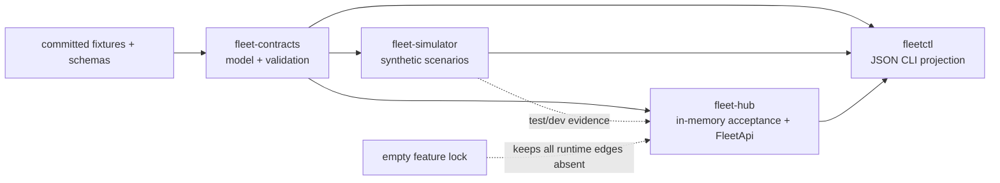
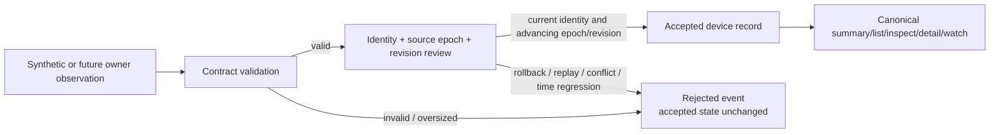

# Milestone 0 Graph And Instruction Review

## Review scope

This bounded review covers only the `rusty-fleet` repository and the active
`fleet-m0-foundation-and-simulator` allowed paths. It excludes ignored
`target/` and `local/` data, other repositories, generated datasets, devices,
SDKs, and private evidence.

Review checkpoint:

- branch: `codex/fleet-m0-foundation`;
- first green source checkpoint: `91019bf`;
- work-environment release: `v0.6.0`;
- work-environment commit: `6b75d944614a8f863dd612c9b114d7c68f0862b0`;
- feature lock: empty and inert.

The inventory began from `git ls-files` and added only the current intended
worktree changes. The first source checkpoint contained 77 tracked public
files. The only ignored workspace roots observed were `target/` and `local/`.

## Source and dependency graph

Production source edges are acyclic:

- `fleet-contracts` depends only on Serde and JSON serialization;
- `fleet-simulator` depends on `fleet-contracts`;
- `fleet-hub` depends on `fleet-contracts`;
- Hub tests use `fleet-simulator` as a development dependency;
- `fleetctl` composes contracts, Hub, and simulator.

No package introduces networking, an asynchronous runtime, Windows APIs, an
Android/Quest API, device tools, LSL, FFmpeg, codecs, a database, or a UI
framework.

## Authority and rejection graph

The graph preserves distinct authority and evidence:

- simulator output is a proposal, not accepted state;
- Hub admission owns the current in-memory product projection only;
- owner conditions retain their own source and authority revision;
- `fleetctl` is a projection consumer, not a parallel state engine;
- optional ADB, File Manager, LSL, media, WPF, persistence, and relay nodes are
  deliberately absent downstream nodes.

## Source pressure

At review time the largest Rust files were:

| File | Approximate lines | Verdict |
| --- | ---: | --- |
| `crates/fleet-hub/src/lib.rs` | 901 | One M0 in-memory authority; below split threshold |
| `crates/fleet-contracts/src/stream.rs` | 826 | One datastream contract family; below split threshold |
| `crates/fleet-simulator/src/lib.rs` | 801 | One deterministic scenario authority; below split threshold |
| `crates/fleet-contracts/tests/contracts.rs` | 403 | Focused contract suite |

No file approaches the project’s 10,000-line pressure threshold, and no source
file currently mixes runtime networking, device, UI, persistence, or media
authority. Split pressure should be reviewed again when real adapters, a
persistent store, or WPF land; file count alone is not a split reason.

## Public/private and activation review

- All committed identities, applications, descriptors, participants, and
  artifacts are explicitly synthetic.
- No workstation path, device serial, endpoint, token, private package,
  capture, binary, or raw device evidence enters public files.
- The feature lock selects no feature, module, permission, service, route,
  stream, input, scene, marker, tool, asset, shader, or native library.
- The dependency graph has no mechanism that could create a runtime effect.
- Device validation remains forbidden for M0.

## Instruction impact

| Surface | Result |
| --- | --- |
| `AGENTS.md` | Updated with the source map, closed boundary, and focused Rust checks |
| `README.md` | Updated from planning-only status to the active inert source foundation |
| `docs/VALIDATION.md` | Updated with locked Rust, fixture, simulator, Clippy, and CLI/API gates |
| `docs/M0_SOURCE_FOUNDATION.md` | Added as the durable implementation and closed-edge guide |
| `docs/decisions/0004-m0-source-boundary-and-threat-model.md` | Added restart-safe producer epochs, finite limits, threats, and deferred ingress security |
| `rusty-morphospace-context` | Installed router refreshed and verified from exact public `v0.6.0` |
| `system-engineering` | Installed router refreshed and verified from exact public `v0.6.0` |
| `rust-work-graph` | Installed router refreshed and verified from exact public `v0.6.0` |
| `meta-quest-workflow` | Installed router refreshed and verified; M0 still invokes no device gate |

The router refresh was necessary because the installed local provenance still
pointed to the older work-environment release. The update used the exact clean
public `v0.6.0` tag, preserved unmanaged local files, and passed the installer’s
managed-file and locator verification.

## Verdict

The M0 source graph matches the active iteration unit:

- one product-owned contract and projection layer;
- one deterministic source-only proposal generator;
- one in-memory Hub authority;
- one CLI projection over the same local API;
- bounded negative paths and an inert feature lock;
- no undeclared adapter or runtime edge.

No repository split, new module, device gate, external protocol, or cross-repo
source extraction is justified before M0 acceptance.
